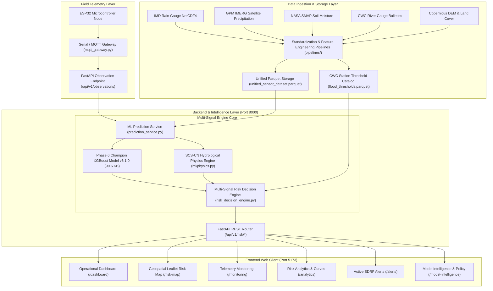

# Jal Drishti — System Architecture Specification

**Target Region:** Uttarakhand, India  
**Architecture Pattern:** Layered Asynchronous REST / Data Pipeline / Multi-Signal Fusion Architecture

---

## 1. High-Level Architecture Diagram

---

## 2. Component Responsibilities

### A. Data Ingestion & Standardization Layer (`pipelines/`)
- Ingests semi-structured monsoonal precipitation from IMD netCDF files and GPM IMERG satellite grids.
- Processes SMAP surface and profile soil moisture volume.
- Standardizes temporal timestamps to UTC and spatial coordinates to Uttarakhand bounding box ($77.5^\circ	ext{E} - 81.0^\circ	ext{E}, 28.7^\circ	ext{N} - 31.5^\circ	ext{N}$).
- Stores standardized datasets in compressed Apache Parquet format (`unified_sensor_dataset.parquet`).

### B. Machine Learning & Hydrological Physics Layer (`ml/`)
- **XGBoost Champion Model (v6.1.0):** Predicts flash flood probability ($0.00 - 1.00$) based on rainfall accumulation, antecedent moisture index, soil saturation, elevation, and terrain slope.
- **SCS-CN Physics Engine (`ml/physics.py`):** Dynamically computes potential retention $S$ and direct surface runoff $Q$:
  $$S = rac{25400}{CN} - 254$$
  $$Q = rac{(P - 0.2S)^2}{P + 0.8S}$$

### C. Multi-Signal Risk Decision Engine (`backend/app/services/risk_decision_engine.py`)
Fuses 4 distinct signals into deterministic risk classes (**LOW, MODERATE, HIGH, EXTREME**):
1. **Phase 6 ML Model Probability:** Categorized into risk bands ($<0.20$ LOW, $0.20-0.40$ MODERATE, $0.40-0.70$ HIGH, $\ge 0.70$ EXTREME).
2. **CWC River Stage Exceedance:** Evaluates observed water level against Warning Level, Danger Level, and Highest Flood Level (HFL).
3. **Atmospheric Forcing:** Identifies Cloudburst conditions ($\ge 65	ext{ mm/h}$ or $\ge 40	ext{ mm/30min}$) and extreme saturation ($\ge 90\%$).
4. **Deterministic Conflict Resolution Rules:**
   - *Hydrological Override:* River stage breaching CWC Danger Level or HFL escalates final risk to HIGH/EXTREME regardless of dry local weather forecasts (accounting for upstream surge).
   - *Impending Surge Warning:* High ML probability and intense rainfall forcing trigger HIGH/EXTREME alerts even if downstream gauges are offline or below warning level.

### D. FastAPI REST Service Layer (`backend/app/main.py`)
- Serves 16 asynchronous REST endpoints on **Port 8000**.
- Manages CORS origins, Pydantic schemas, and error handlers.

### E. Presentation Client Layer (`frontend/`)
- Single Page Application built with React 18, Vite 5, Tailwind CSS, Leaflet, and Recharts.
- Proxies `/api` requests to backend Port 8000.

---
*Jal Drishti Technical Documentation*
