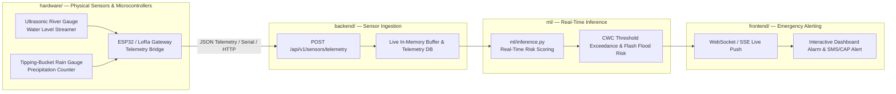

# FlashFloodAI — System Architecture Blueprint & Data Flow Contracts

**Document Version:** 1.0.0  
**Target Region:** Uttarakhand, India ($77.8^\circ\text{E} - 81.1^\circ\text{E},\, 28.5^\circ\text{N} - 31.5^\circ\text{N}$)  
**Standard Spatial Reference:** EPSG:4326 (WGS-84)  
**Lead Architect:** AI Lead Software & Data Architect  

---

## 1. High-Level Architectural Blueprint

FlashFloodAI is designed around a modular, layered architecture separating raw Earth observation pipelines, ML intelligence, API routing, and web visualization.

### Primary Data-to-Dashboard Architecture

```mermaid
graph TD
    subgraph DATA_SOURCES [Authoritative Environmental Data Sources]
        S1[NASA GPM IMERG Early v07<br/>Precipitation 0.1°]
        S2[IMD Ground Weather Stations<br/>157 Uttarakhand Gauges]
        S3[NASA SMAP L4 / SPL4SMAU<br/>Soil Moisture Grids]
        S4[SRTM 90m DEM<br/>Elevation & Catchments]
        S5[ESA WorldCover 10m<br/>Sentinel-2 Land Cover]
        S6[CWC / India-WRIS<br/>20 River Gauge Stations]
        S7[NDMA / GSI / USDMA<br/>15 Historical Flood Disasters]
    end

    subgraph PIPELINES_LAYER [pipelines/ — Ingestion & Feature Engineering]
        P1[Raw Data Ingestion & Cropping<br/>scripts/*_ingest.py]
        P2[Phase 2 Data Standardization<br/>unified_static_features.nc & standardized_dynamic_atmosphere.nc]
        P3[Phase 3 Multimodal Feature Engineering<br/>Hydrodynamic Indices: SPI, STI, TRP, FFSI, SSI, Peff, API]
        P4[Phase 4 Government Flood Threshold Engine<br/>Warning, Danger, HFL Monotonicity & Alerts]
    end

    subgraph ML_LAYER [ml/ — Machine Learning Engine]
        M1[Phase 5 ML Feature Dataset<br/>8,199 Spatio-Temporal Samples x 51 Features]
        M2[Time-Aware Validation Partitions<br/>Train: 62.5% | Val: 25.0% | Test: 12.5% | Benchmark: 15 Disasters]
        M3[Champion Random Forest Model<br/>100 Trees, Depth 6, Class-Weighted, Brier Calibrated]
        M4[Inference & Explainability Engine<br/>ml/inference.py & Feature Importance Attribution]
    end

    subgraph BACKEND_LAYER [backend/ — Phase 7 REST API Service]
        B1[FastAPI REST Service<br/>OpenAPI Endpoints]
        B2[Spatial Query Router<br/>GeoJSON Catchment Alerts & Threshold Exceedances]
        B3[Historical Archive Service<br/>1970–2024 Disaster Hindcasts]
    end

    subgraph FRONTEND_LAYER [frontend/ — Phase 8 Web Application]
        F1[Interactive Statewide Risk Map<br/>0.1° Grid & River Basins]
        F2[CWC River Gauge Hydrographs<br/>Warning/Danger Thresholds]
        F3[Radar & Waterfall Explainability<br/>Top 15 Feature Contributions]
    end

    subgraph VISUALIZATION_LAYER [visualization/ — Reusable Visualizers]
        V1[Deck.gl / Leaflet Map Shaders]
        V2[D3.js / Chart.js Time-Series Hydrographs]
        V3[Three.js 3D Mountain Catchment Models]
    end

    DATA_SOURCES --> PIPELINES_LAYER
    PIPELINES_LAYER --> ML_LAYER
    ML_LAYER --> BACKEND_LAYER
    BACKEND_LAYER --> FRONTEND_LAYER
    FRONTEND_LAYER --> VISUALIZATION_LAYER
```

---

## 2. Future Hardware & IoT Sensor Pathway



---

## 3. Data Flow Contracts & Inter-Module Interfaces

### A. Data Pipeline $\to$ Machine Learning Contract
- **Artifact**: `data/processed/ml/flood_ml_features.parquet`
- **Schema**: 8,199 rows $\times$ 51 features.
- **Rules**:
  - `EPSG:4326` coordinate bounds ($[77.8^\circ\text{E}, 81.1^\circ\text{E}]$, $[28.5^\circ\text{N}, 31.5^\circ\text{N}]$).
  - All timestamps formatted as ISO 8601 UTC.
  - Zero synthetic data, zero fake zero-fills for offline CWC telemetry (`water_level_m = NaN`, `water_level_missing = 1`).

### B. Machine Learning $\to$ Backend Contract
- **Wrapper**: `ml.inference.FloodRiskInferenceEngine`
- **Method**: `predict_sample(feature_dict: dict) -> dict`
- **Output Schema**:
  ```json
  {
    "probability": 0.8520,
    "risk_class": "EXTREME",
    "decision_threshold": 0.40,
    "is_alarm": true
  }
  ```

### C. Backend $\to$ Frontend Contract
- **REST Endpoints**:
  - `GET /api/v1/risk/current` $\to$ Returns latest grid and gauge risk payload.
  - `GET /api/v1/risk/timeseries` $\to$ Returns time-series predictions for charts.
  - `GET /api/v1/gauges` $\to$ Returns 20 CWC stations, water levels, and warning/danger/HFL thresholds.
  - `GET /api/v1/events` $\to$ Returns 15 canonical disaster event GeoJSON features.
- **WebSocket Feed**: `WS /api/v1/alerts/live` $\to$ Streams real-time emergency flash-flood alerts.

---

## 4. Developer Domain Ownership

- **Data / Pipeline Developers**: Own `pipelines/`, `data/raw/`, `data/processed/`.
- **ML / Data Science Developers**: Own `ml/`, `data/processed/ml/models/`.
- **Backend Developers**: Own `backend/`, `tests/`.
- **Frontend Developers**: Own `frontend/`.
- **Visualization Developers**: Own `visualization/`.
- **Hardware / IoT Developers**: Own `hardware/`.
