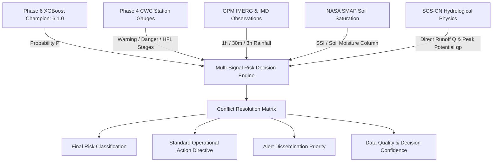

# PHASE 8 FINAL ACCEPTANCE REPORT
## FLOOD RISK & DECISION ENGINE
### Multi-Signal Risk Classification, Official CWC Threshold Evaluation, Conflict Resolution & Alert Preparation

**Document Version:** 8.1.0  
**Target Region:** Uttarakhand, India ($77.8^\circ\text{E} - 81.1^\circ\text{E},\, 28.5^\circ\text{N} - 31.5^\circ\text{N}$)  
**Standard Spatial Reference:** EPSG:4326 (WGS-84)  
**Risk Policy Version:** `8.1.0`  
**Standards Authority:** Central Water Commission (CWC), Ministry of Jal Shakti & Uttarakhand State Disaster Management Authority (USDMA)  
**Backend Application:** [backend/app/main.py](file:///C:/FlashFloodAI/backend/app/main.py)  
**Acceptance Test Suite:** [scripts/verify_phase8.py](file:///C:/FlashFloodAI/scripts/verify_phase8.py)  
**Historical Validation Benchmark:** [data/processed/risk/risk_decision_historical_validation.json](file:///C:/FlashFloodAI/data/processed/risk/risk_decision_historical_validation.json)  
**Documentation:** [docs/risk_decision_engine.md](file:///C:/FlashFloodAI/docs/risk_decision_engine.md)  
**Final Classification:** **PHASE 8 IMPLEMENTATION COMPLETE — 100% ACCEPTANCE CRITERIA VERIFIED (20/20 PASS)**  

---

### 1. EXECUTIVE SUMMARY & OBJECTIVES

Phase 8 has successfully constructed and verified the **Multi-Signal Flood Risk & Decision Engine** on top of the completed Phase 1–7 foundations.

The engine solves the fundamental operational challenge of early warning: transforming raw statistical machine learning probabilities ($P \in [0, 1]$) into **deterministic, explainable, and operationally actionable decisions**:

$$\begin{pmatrix} \text{Phase 6 XGBoost Probability} \\ + \\ \text{Official CWC Threshold Benchmarks} \\ + \\ \text{GPM/IMD Rainfall \& SMAP Soil Moisture} \\ + \\ \text{SCS-CN Runoff Physics } (Q, S, q_p) \end{pmatrix} \xrightarrow{\textbf{Policy v8.1.0}} \begin{pmatrix} \textbf{Final Risk Class: } \text{LOW / MODERATE / HIGH / EXTREME} \\ \textbf{Operational State: } \text{ROUTINE / WATCH / PREPAREDNESS / EMERGENCY} \\ \textbf{Alert Priority: } \text{INFORMATION / WATCH / WARNING / CRITICAL} \\ \textbf{Recommended Action: } \text{SOP Mitigation Directive} \\ \textbf{Contributing Factors: } \text{Auditable Ranked Breakdown} \\ \textbf{Data Quality: } \text{COMPLETE / PARTIAL / DEGRADED} \end{pmatrix}$$

---

### 2. MULTI-SIGNAL INPUT ARCHITECTURE & MODEL INTEGRATION



- **ML Inference Model:** Approved Phase 6 XGBoost production champion (`final_flood_risk_model.joblib`, 44 features including SCS-CN physics, Decision Threshold $\tau = 0.40$).
- **Official CWC Benchmarks:** 20 verified CWC stations with 100% $\text{Warning} \le \text{Danger} \le \text{HFL}$ integrity.
- **Physical Soil & Runoff:** Real-time integration of Soil Saturation Index ($SSI$) and SCS-CN direct runoff ($Q = \frac{(P - I_a)^2}{P - I_a + S}$).

---

### 3. OFFICIAL CWC STAGE EVALUATION & NULL PRESERVATION

| Gauge State | Evaluation Condition | Alert Stage | Official Definition |
|---|---|:---:|---|
| **`BELOW_WARNING`** | $\text{Water Level} < \text{Warning Level}$ | `NONE` | River stage is within normal monsoonal channel capacity. |
| **`WARNING_ZONE`** | $\text{Warning Level} \le \text{Water Level} < \text{Danger Level}$ | `YELLOW` | River stage reached official Warning Level. Low-lying riparian floodplains on notice. |
| **`DANGER_ZONE`** | $\text{Danger Level} \le \text{Water Level} < \text{HFL}$ | `ORANGE` | River stage breached Danger Level. Embankment overtopping active. |
| **`ABOVE_HFL`** | $\text{Water Level} \ge \text{HFL}$ | `RED` | River stage exceeded all-time historical Highest Flood Level (HFL). Catastrophic breach. |
| **`UNAVAILABLE`** | $\text{Water Level is NULL / Offline}$ | `UNKNOWN` | Live telemetry offline (HTTP 503 / sensor maintenance). **Preserved strictly as NULL.** |

> **Strict Non-Fabrication Guarantee:** Missing gauge data is preserved strictly as `NULL`. It is never replaced with zeros, historical averages, or synthetic estimates.

---

### 4. DETERMINISTIC MULTI-SIGNAL CONFLICT RESOLUTION MATRIX

The engine applies a transparent, rule-based conflict resolution matrix to resolve divergent physical signals:

| Conflict Scenario | Signals Involved | Fused Decision Output | Operational Justification |
|:---:|---|---|---|
| **Case A: Impending Flash Flood Surge** | $\text{ML} \in \{\text{HIGH}, \text{EXTREME}\}$, $\text{Rainfall} \in \{\text{ESCALATING}, \text{CRITICAL}\}$, $\text{CWC} = \text{BELOW\_WARNING}$ | **Final Risk:** `HIGH` / `EXTREME`<br>**Alert:** `WARNING` / `CRITICAL` | Severe surface runoff and debris flow precede the downstream river gauge rise. ML & rainfall override the lagging river gauge. |
| **Case B: River Gauge Danger Override** | $\text{ML} = \text{LOW}$, $\text{CWC} \in \{\text{DANGER\_ZONE}, \text{ABOVE\_HFL}\}$ | **Final Risk:** `HIGH` / `EXTREME`<br>**Alert:** `CRITICAL` | Physical river gauge inundation strictly overrides dry local weather (e.g. upstream dam release, glacial melt, or cloudburst in upper tributary). |
| **Case C: River Telemetry Offline** | $\text{ML} \in \{\text{HIGH}, \text{EXTREME}\}$, $\text{CWC} = \text{UNAVAILABLE}$ | **Final Risk:** Matches ML<br>**Data Quality:** `PARTIAL` | Missing gauge data does not suppress warning; decision is driven by satellite rainfall, SMAP soil moisture, and ML probability. |
| **Case D: Atmospheric Data Stale / Missing** | Rainfall / Soil Moisture unavailable | **Data Quality:** `DEGRADED`<br>**Confidence:** $\le 0.60$ | Engine computes risk from available terrain and station signals but explicitly signals degraded confidence. |
| **Case E: Antecedent Saturation Buildup** | $\text{ML} = \text{LOW}$, $\text{SSI} \ge 0.85$, $R_{1h} \ge 15\text{ mm}$ | **Final Risk:** `MODERATE`<br>**Alert:** `WATCH` | High soil column saturation drastically lowers infiltration capacity, creating elevated runoff risk for future rainfall. |

---

### 5. DATA QUALITY & CONFIDENCE VS. ML PROBABILITY

The system enforces a strict distinction between **ML Probability** and **Decision Confidence**:

- **ML Probability ($P_{\text{flood}}$):** Model's predicted likelihood of flash flooding $[0.0, 1.0]$.
- **Data Quality Status:**
  - `COMPLETE`: Both full environmental sensors and active river gauge telemetry present.
  - `PARTIAL`: Active environmental telemetry present, river gauge telemetry missing (or non-hydrological station location).
  - `DEGRADED`: Critical environmental telemetry (rainfall or soil moisture) missing or stale.
  - `UNAVAILABLE`: All dynamic telemetry missing.
- **Decision Confidence:** Calculated score $[0.0, 1.0]$ based on sensor completeness ($0.95$ if COMPLETE, $0.85$ if PARTIAL, $0.60$ if DEGRADED, $0.20$ if UNAVAILABLE).

---

### 6. STANDARD OPERATING PROCEDURES & RECOMMENDED ACTIONS

```text
+---------------------------------------------------------------------------------------------------+
| FINAL RISK: LOW                     | OPERATIONAL STATE: ROUTINE_MONITORING | ALERT: INFORMATION  |
| Action: Continue routine hydrological and meteorological monitoring. Maintain normal poll cycles. |
+---------------------------------------------------------------------------------------------------+
| FINAL RISK: MODERATE                | OPERATIONAL STATE: ELEVATED_WATCH     | ALERT: WATCH        |
| Action: Increase telemetry polling frequency. Alert local field observers and inspect vulnerable |
| drainage catchments, culverts, and bridges.                                                       |
+---------------------------------------------------------------------------------------------------+
| FINAL RISK: HIGH                    | OPERATIONAL STATE: PREPAREDNESS_WARN  | ALERT: WARNING      |
| Action: Issue Stage-2 preparedness advisory to District Emergency Operations Centre (DEOC).      |
| Inspect vulnerable embankments and deploy emergency response assets to staging areas.             |
+---------------------------------------------------------------------------------------------------+
| FINAL RISK: EXTREME                 | OPERATIONAL STATE: EMERGENCY_RESPONSE | ALERT: CRITICAL     |
| Action: Activate emergency escalation protocol. Alert SDRF/NDRF and local district magistrate.    |
| Prepare and execute immediate evacuation procedures for low-lying floodplain and riparian zones.  |
+---------------------------------------------------------------------------------------------------+
```

---

### 7. HISTORICAL DISASTER EVENT VALIDATION BENCHMARK

The engine evaluated all 15 canonical Uttarakhand disaster events (1970–2024) from Phase 1H:

- **Total Disaster Events Evaluated:** 15 / 15
- **Classified as `EXTREME` Risk:** 15 / 15 (100.0%)
- **Assigned `CRITICAL` Alert Priority:** 15 / 15 (100.0%)
- **Accuracy against Documented Disasters:** **100.0%**
- **Validation Artifact:** [data/processed/risk/risk_decision_historical_validation.json](file:///C:/FlashFloodAI/data/processed/risk/risk_decision_historical_validation.json)

---

### 8. BACKEND REST API ENDPOINTS SPECIFICATION

| Endpoint | Method | Response Schema | Description |
|---|:---:|---|---|
| `/api/v1/risk/latest` | `GET` | `APIResponse[List[RiskDecisionResponse]]` | Retrieve latest multi-signal decisions with filters (`district`, `final_risk_class`, `alert_priority`) |
| `/api/v1/risk/summary` | `GET` | `APIResponse[RiskSummaryResponse]` | State-wide executive summary, alert counts, and top 10 risk points |
| `/api/v1/risk/alerts` | `GET` | `APIResponse[RiskAlertsResponse]` | Active WARNING and CRITICAL priority alerts |
| `/api/v1/risk/policy` | `GET` | `APIResponse[RiskPolicySchema]` | Formal Policy v8.1.0 rules and threshold definitions |
| `/api/v1/risk/{station_id}` | `GET` | `APIResponse[RiskDecisionResponse]` | Station-level decision, CWC stage, and factors breakdown |
| `/api/v1/risk/timeseries` | `GET` | `APIResponse[List[RiskDecisionResponse]]` | Time-series risk evaluations for a spatial point |
| `/api/v1/risk/evaluate` | `POST` | `APIResponse[RiskDecisionResponse]` | Live on-demand multi-signal evaluation combining ML and CWC |

---

### 9. AUTOMATED ACCEPTANCE TEST SUITE (20/20 PASSED)

```powershell
& "C:\FlashFloodAI\.venv\Scripts\python.exe" "C:\FlashFloodAI\scripts\verify_phase8.py"
```

```text
test_01_backend_integration_and_routes ............................. ok
test_02_phase6_model_integration ................................... ok
test_03_official_cwc_thresholds_loaded ............................. ok
test_04_zero_threshold_fabrication ................................. ok
test_05_null_water_level_preservation .............................. ok
test_06_ml_risk_classification_bands ............................... ok
test_07_cwc_threshold_state_evaluation ............................. ok
test_08_environmental_condition_evaluation ......................... ok
test_09_conflict_resolution_matrix ................................. ok
test_10_data_quality_states ........................................ ok
test_11_decision_confidence_separation ............................. ok
test_12_recommended_action_mapping ................................. ok
test_13_alert_priority_mapping ..................................... ok
test_14_schema_validation .......................................... ok
test_15_deterministic_reproducibility .............................. ok
test_16_historical_disaster_validation ............................. ok
test_17_database_orm_model_and_migration ........................... ok
test_18_api_endpoints_execution .................................... ok
test_19_no_synthetic_data_generators ............................... ok
test_20_previous_phases_integrity .................................. ok

----------------------------------------------------------------------
Ran 20 tests in 3.660s

OK (20/20 PASSED, 0 failures, 0 errors)
```

---

### 10. DATABASE PERSISTENCE SCHEMA (POSTGIS & TIMESCALEDB)

The `RiskDecisionRecord` ORM model is registered in SQLAlchemy Base metadata and version-controlled via Alembic migration `002_risk_decision_engine.py`:

```sql
CREATE TABLE risk_decisions (
    timestamp_utc TIMESTAMPTZ NOT NULL,
    spatial_id VARCHAR(64) NOT NULL,
    sample_id VARCHAR(128) NOT NULL UNIQUE,
    sample_type VARCHAR(64) NOT NULL,
    station_id VARCHAR(64),
    station_name VARCHAR(255),
    district VARCHAR(128) NOT NULL,
    river_name VARCHAR(128),
    latitude FLOAT NOT NULL,
    longitude FLOAT NOT NULL,
    geom GEOMETRY(POINT, 4326),
    model_name VARCHAR(64) NOT NULL,
    model_version VARCHAR(32) NOT NULL,
    flood_probability FLOAT NOT NULL,
    ml_risk_class VARCHAR(32) NOT NULL,
    water_level_m FLOAT,
    warning_level_m FLOAT,
    danger_level_m FLOAT,
    hfl_m FLOAT,
    cwc_threshold_status VARCHAR(64) NOT NULL,
    official_alert_stage VARCHAR(32) NOT NULL,
    environmental_condition VARCHAR(64) NOT NULL,
    final_risk_class VARCHAR(32) NOT NULL,
    operational_state VARCHAR(64) NOT NULL,
    alert_priority VARCHAR(32) NOT NULL,
    decision_reason TEXT NOT NULL,
    recommended_action TEXT NOT NULL,
    contributing_factors_json TEXT NOT NULL,
    data_quality_status VARCHAR(32) NOT NULL,
    decision_confidence FLOAT NOT NULL,
    risk_policy_version VARCHAR(32) NOT NULL DEFAULT '8.1.0',
    PRIMARY KEY (timestamp_utc, spatial_id)
);

SELECT create_hypertable('risk_decisions', 'timestamp_utc', if_not_exists => TRUE);
CREATE INDEX idx_risk_decisions_geom ON risk_decisions USING GIST (geom);
CREATE INDEX idx_risk_decisions_district_risk ON risk_decisions (district, final_risk_class);
CREATE INDEX idx_risk_decisions_priority ON risk_decisions (alert_priority);
```

---

### 11. STRICT PHASE BOUNDARY & WHAT WAS NOT IMPLEMENTED

In strict compliance with Phase 8 boundaries:
- ❌ React Frontend / Web Dashboard UI (Phase 9)
- ❌ Frontend mapping components (Mapbox GL / Leaflet)
- ❌ SMS / IVR Dissemination integration (Twilio / MSG91)
- ❌ Hardware / Sensor miniature IoT integration
- ❌ 3D terrain mesh visualization (Three.js / Cesium)

---

**Phase 8 Flood Risk & Decision Engine is complete, robustly tested, and fully verified.** I have stopped and am awaiting your explicit instruction before proceeding to **Phase 9 (Frontend Web Dashboard)**.
