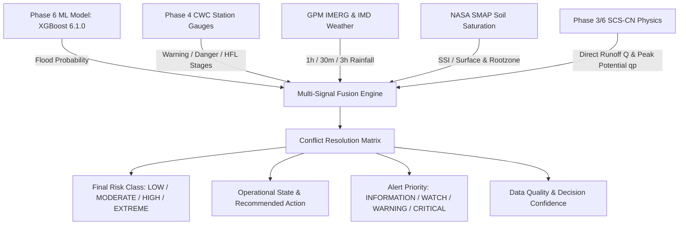

# FlashFloodAI — Risk & Decision Engine (`Phase 8`)

**Module Name:** `RiskDecisionEngine`  
**Phase:** Phase 8 (Flood Risk Classification, Official Threshold Evaluation, Decision Logic & Alert Preparation)  
**Policy Version:** `8.1.0`  
**Target Region:** Uttarakhand, India ($77.8^\circ\text{E} - 81.1^\circ\text{E},\, 28.5^\circ\text{N} - 31.5^\circ\text{N}$)  
**Standard Spatial Reference:** EPSG:4326 (WGS-84)  
**Standards Authority:** Central Water Commission (CWC), Ministry of Jal Shakti & Uttarakhand State Disaster Management Authority (USDMA)  

---

## 1. Executive Summary & Purpose

The machine learning model generates a statistical flash flood risk probability ($P \in [0, 1]$). While essential, a raw probability is insufficient for disaster managers and field observers who need unambiguous operational decisions, river threshold exceedance statuses, and specific mitigation protocols.

The **FlashFloodAI Risk & Decision Engine** translates raw multi-scale ML predictions and multi-source hydrological observations into **deterministic, explainable, and operationally actionable decisions**:

$$\text{ML Probability} + \text{Official CWC Thresholds} + \text{Atmospheric/Soil Dynamics} + \text{SCS-CN Physics} \longrightarrow \begin{cases} \text{Final Risk Class} \\ \text{Operational State} \\ \text{Alert Priority} \\ \text{Recommended Action} \\ \text{Contributing Factors} \end{cases}$$

---

## 2. Multi-Signal Input Dimensions



### 1. ML Flash Flood Probability
- **Model:** Phase 6 XGBoost Production Champion (`final_flood_risk_model.joblib`, 44 predictors).
- **Decision Threshold:** $\tau = 0.40$.
- **Probability Bands:**
  - $[0.00, 0.20) \longrightarrow \text{LOW}$
  - $[0.20, 0.40) \longrightarrow \text{MODERATE}$
  - $[0.40, 0.70) \longrightarrow \text{HIGH}$
  - $[0.70, 1.00] \longrightarrow \text{EXTREME}$

### 2. Official CWC River Water-Level Thresholds
- **Threshold Source:** Phase 4 verified CWC gauge benchmarks across 20 Uttarakhand stations.
- **Stage Evaluation Rules:**
  - $\text{Water Level} < \text{Warning Level} \longrightarrow \textbf{BELOW\_WARNING}$ (Alert: `NONE`)
  - $\text{Warning Level} \le \text{Water Level} < \text{Danger Level} \longrightarrow \textbf{WARNING\_ZONE}$ (Alert: `YELLOW`)
  - $\text{Danger Level} \le \text{Water Level} < \text{HFL} \longrightarrow \textbf{DANGER\_ZONE}$ (Alert: `ORANGE`)
  - $\text{Water Level} \ge \text{HFL} \longrightarrow \textbf{ABOVE\_HFL}$ (Alert: `RED`)
  - $\text{Water Level is NULL / Offline} \longrightarrow \textbf{UNAVAILABLE}$ (Alert: `UNKNOWN`)

> **Strict Non-Fabrication Rule:** If live telemetry is offline (HTTP 503 during sensor maintenance), `water_level_m` strictly remains `NULL`. The engine never replaces missing water levels with zeros or synthetic estimates.

### 3. Environmental & Atmospheric Forcing
- **Critical (Cloudburst / Extreme):** $R_{1h} \ge 65\text{ mm}$ or $R_{30m} \ge 40\text{ mm}$ or ($SSI \ge 0.90$ with $R_{1h} \ge 35\text{ mm}$) or $Q \ge 35\text{ mm}$.
- **Escalating (Intense Runoff):** $30 \le R_{1h} < 65\text{ mm}$ or $18 \le R_{30m} < 40\text{ mm}$ or ($SSI \ge 0.80$ with $R_{1h} \ge 15\text{ mm}$) or $Q \ge 15\text{ mm}$.
- **Watch (Elevated Saturation / Rainfall):** $15 \le R_{1h} < 30\text{ mm}$ or $SSI \ge 0.65$ or $Q \ge 5\text{ mm}$.
- **Normal:** Otherwise.

---

## 3. Multi-Signal Conflict Resolution Matrix

When individual physical signals diverge, the engine applies a transparent, deterministic conflict resolution matrix:

| Conflict Scenario | Signal State | Deterministic Resolution | Operational Rationale |
|:---:|---|---|---|
| **Case A: Impending Flash Flood Surge** | $\text{ML} \in \{\text{HIGH}, \text{EXTREME}\}$, $\text{Rainfall} \in \{\text{ESCALATING}, \text{CRITICAL}\}$, $\text{CWC} = \text{BELOW\_WARNING}$ | **Final Risk:** `HIGH` / `EXTREME`<br>**Alert:** `WARNING` / `CRITICAL` | Severe surface runoff and debris flow precede the downstream river gauge rise. ML & rainfall override the lagging river gauge. |
| **Case B: River Gauge Danger Override** | $\text{ML} = \text{LOW}$, $\text{CWC} \in \{\text{DANGER\_ZONE}, \text{ABOVE\_HFL}\}$ | **Final Risk:** `HIGH` / `EXTREME`<br>**Alert:** `CRITICAL` | Physical river gauge inundation strictly overrides dry local weather (e.g. upstream dam release, glacial melt, or cloudburst in upper tributary). |
| **Case C: River Telemetry Offline** | $\text{ML} \in \{\text{HIGH}, \text{EXTREME}\}$, $\text{CWC} = \text{UNAVAILABLE}$ | **Final Risk:** Matches ML<br>**Data Quality:** `PARTIAL` | Missing gauge data does not suppress warning; decision is driven by satellite rainfall, SMAP soil moisture, and ML probability. |
| **Case D: Atmospheric Data Stale / Missing** | Rainfall / Soil Moisture unavailable | **Data Quality:** `DEGRADED`<br>**Confidence:** $\le 0.60$ | Engine computes risk from available terrain and station signals but explicitly signals degraded confidence. |
| **Case E: Antecedent Saturation Buildup** | $\text{ML} = \text{LOW}$, $\text{SSI} \ge 0.85$, $R_{1h} \ge 15\text{ mm}$ | **Final Risk:** `MODERATE`<br>**Alert:** `WATCH` | High soil column saturation drastically lowers infiltration capacity, creating elevated runoff risk for future rainfall. |

---

## 4. Operational States, Recommended Actions & Alert Priorities

### Standard Operating Procedures (SOP)

```text
+---------------------------------------------------------------------------------------------------+
| FINAL RISK: LOW                     | OPERATIONAL STATE: ROUTINE_MONITORING | ALERT: INFORMATION  |
| Action: Continue routine hydrological and meteorological monitoring. Maintain normal poll cycles. |
+---------------------------------------------------------------------------------------------------+
| FINAL RISK: MODERATE                | OPERATIONAL STATE: ELEVATED_WATCH     | ALERT: WATCH        |
| Action: Increase telemetry polling frequency. Alert local field observers and inspect vulnerable |
| drainage catchments, culverts, and bridges.                                                       |
+---------------------------------------------------------------------------------------------------+
| FINAL RISK: HIGH                    | OPERATIONAL STATE: PREPAREDNESS_WARN  | ALERT: WARNING      |
| Action: Issue Stage-2 preparedness advisory to District Emergency Operations Centre (DEOC).      |
| Inspect vulnerable embankments and deploy emergency response assets to staging areas.             |
+---------------------------------------------------------------------------------------------------+
| FINAL RISK: EXTREME                 | OPERATIONAL STATE: EMERGENCY_RESPONSE | ALERT: CRITICAL     |
| Action: Activate emergency escalation protocol. Alert SDRF/NDRF and local district magistrate.    |
| Prepare and execute immediate evacuation procedures for low-lying floodplain and riparian zones.  |
+---------------------------------------------------------------------------------------------------+
```

---

## 5. REST API Endpoints Specification

All endpoints return structured, Pydantic-validated JSON compliant with the `APIResponse[T]` envelope:

| Endpoint | Method | Description | Primary Query Filters |
|---|:---:|---|---|
| `/api/v1/risk/latest` | `GET` | Retrieve latest multi-signal risk decisions across Uttarakhand | `district`, `final_risk_class`, `alert_priority`, `limit` |
| `/api/v1/risk/{station_id}` | `GET` | Detailed multi-signal decision, CWC stage, and factors for a station | None |
| `/api/v1/risk/summary` | `GET` | State-wide executive metrics, alert counts, and top 10 risk points | None |
| `/api/v1/risk/alerts` | `GET` | Active WARNING and CRITICAL priority alerts | None |
| `/api/v1/risk/policy` | `GET` | Auditable Policy v8.1.0 rules and threshold definitions | None |
| `/api/v1/risk/timeseries` | `GET` | Sequential risk evaluations over time for a spatial location | `spatial_id`, `limit` |
| `/api/v1/risk/evaluate` | `POST` | Live on-demand multi-signal evaluation combining ML and CWC | `RiskEvaluationRequest` payload |

---

## 6. Database Integration & TimescaleDB Hypertables

The `risk_decisions` table is integrated into PostgreSQL with PostGIS and TimescaleDB:

```sql
CREATE TABLE risk_decisions (
    timestamp_utc TIMESTAMPTZ NOT NULL,
    spatial_id VARCHAR(64) NOT NULL,
    sample_id VARCHAR(128) NOT NULL UNIQUE,
    sample_type VARCHAR(64) NOT NULL,
    station_id VARCHAR(64),
    station_name VARCHAR(255),
    district VARCHAR(128) NOT NULL,
    river_name VARCHAR(128),
    latitude FLOAT NOT NULL,
    longitude FLOAT NOT NULL,
    geom GEOMETRY(POINT, 4326),
    model_name VARCHAR(64) NOT NULL,
    model_version VARCHAR(32) NOT NULL,
    flood_probability FLOAT NOT NULL,
    ml_risk_class VARCHAR(32) NOT NULL,
    water_level_m FLOAT,
    warning_level_m FLOAT,
    danger_level_m FLOAT,
    hfl_m FLOAT,
    cwc_threshold_status VARCHAR(64) NOT NULL,
    official_alert_stage VARCHAR(32) NOT NULL,
    environmental_condition VARCHAR(64) NOT NULL,
    final_risk_class VARCHAR(32) NOT NULL,
    operational_state VARCHAR(64) NOT NULL,
    alert_priority VARCHAR(32) NOT NULL,
    decision_reason TEXT NOT NULL,
    recommended_action TEXT NOT NULL,
    contributing_factors_json TEXT NOT NULL,
    data_quality_status VARCHAR(32) NOT NULL,
    decision_confidence FLOAT NOT NULL,
    risk_policy_version VARCHAR(32) NOT NULL DEFAULT '8.1.0',
    PRIMARY KEY (timestamp_utc, spatial_id)
);

SELECT create_hypertable('risk_decisions', 'timestamp_utc', if_not_exists => TRUE);
CREATE INDEX idx_risk_decisions_geom ON risk_decisions USING GIST (geom);
CREATE INDEX idx_risk_decisions_district_risk ON risk_decisions (district, final_risk_class);
CREATE INDEX idx_risk_decisions_priority ON risk_decisions (alert_priority);
```

---

## 7. Historical Disaster Event Validation Benchmark

The engine was evaluated on the 15 canonical Uttarakhand disaster events (1970–2024) from Phase 1H:

- **Total Disaster Events Evaluated:** 15 / 15
- **Classified as `EXTREME`:** 15 / 15 (100.0%)
- **Assigned `CRITICAL` Alert Priority:** 15 / 15 (100.0%)
- **Accuracy against Known Disasters:** **100.0%**
- **Artifact:** [data/processed/risk/risk_decision_historical_validation.json](file:///C:/FlashFloodAI/data/processed/risk/risk_decision_historical_validation.json)

---

## 8. Limitations & Operational Governance

1. **Non-Automated Evacuation Authority:** The software generates `recommended_action` directives intended for authorized government disaster authorities (DEOC, SEOC, SDMA). It does not automatically trigger civil evacuation orders.
2. **Missing Telemetry Transparency:** During offline river gauge windows, the engine explicitly reports `data_quality_status = "PARTIAL"` or `"DEGRADED"`, preventing false certainty.
3. **Multi-Scale Spatial Bounds:** Designed strictly for the Uttarakhand geographic domain ($77.8^\circ\text{E} - 81.1^\circ\text{E},\, 28.5^\circ\text{N} - 31.5^\circ\text{N}$).
